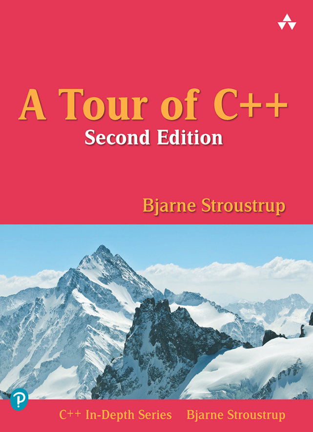

## A Tour of C++

#### 1. The Basics

#### 2. User-Defined Types

#### 3. Modularity

#### 4. Classes

#### 5. Essential Operations

#### 6. Templates

#### 7. Concepts and Generic Porgramming

#### 8. Library Overview

#### 9. Strings and Regular Expressions

#### 10. Input and Ouput

#### 11. Containers

#### 12. Algorithms

#### 13. Utilities

#### 14. Numerics

#### 15. Concurrency

#### 16. History and Compatibility
